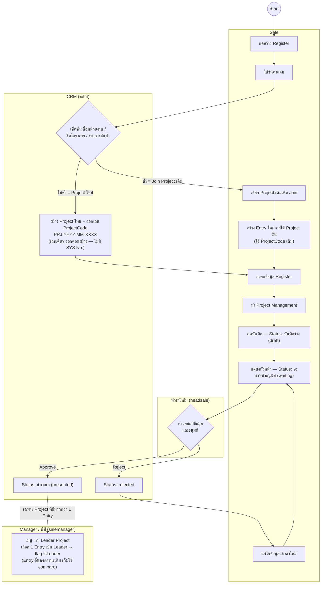
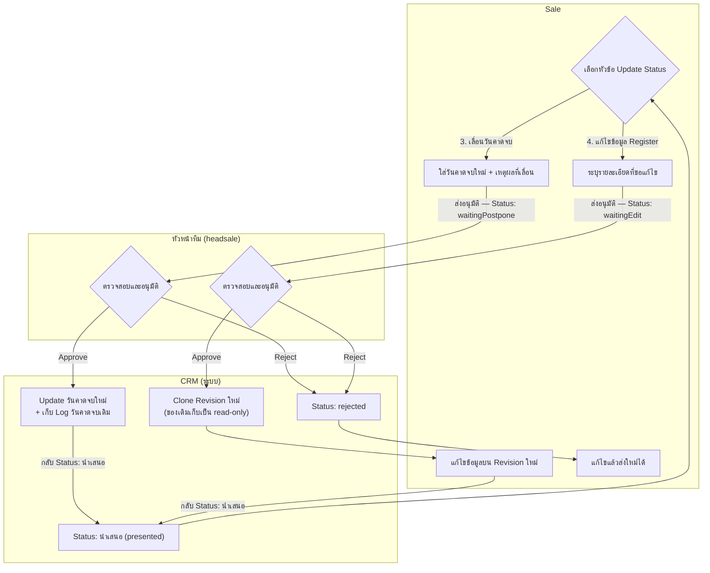
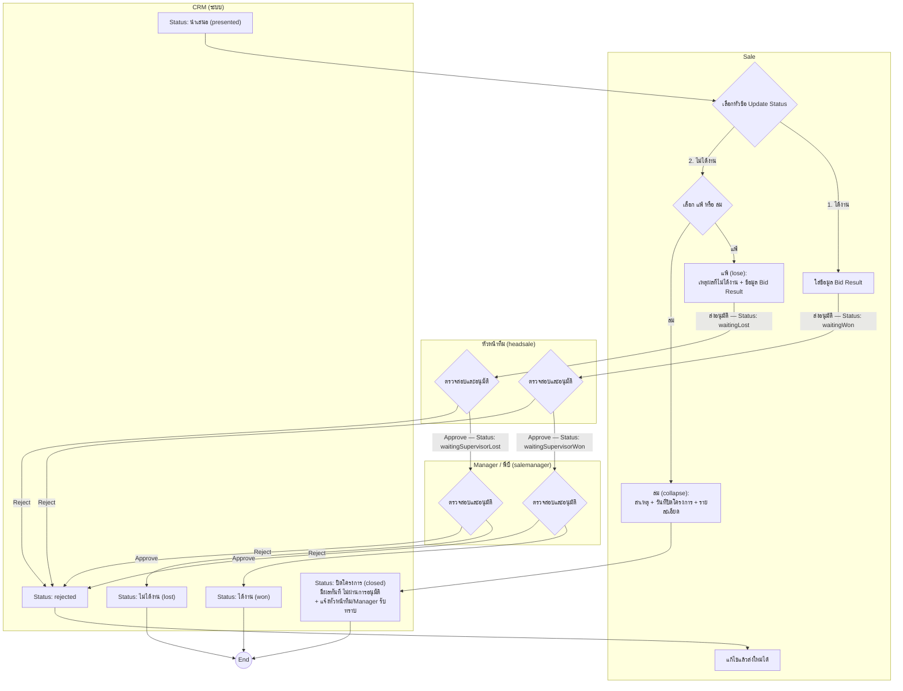
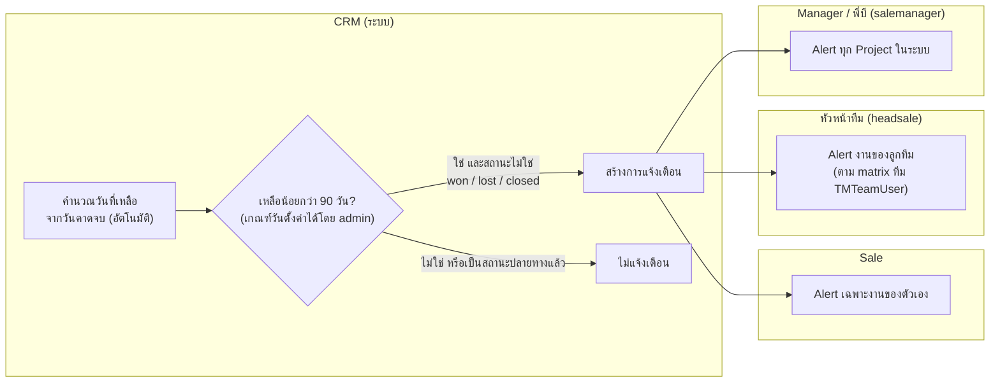

# Flow Project Register — Mermaid (แยกตาม Role)

> แปลงจาก `FlowProjectRegis(Update)_compressed.pdf` (ชุด updated-flow 18 ก.ค. 2026)
> **ปรับตามคำตอบข้อ 9.17–9.21 ที่ปิดครบแล้ว** — จุดที่วาดต่างจาก PDF สรุปไว้ในตารางท้ายไฟล์
>
> ทุกไดอะแกรมแบ่งเลนเป็น 4 role: **Sale** · **หัวหน้าทีม (headsale)** · **Manager / พี่บี (salemanager)** · **CRM (ระบบอัตโนมัติ)**

---

## 1) สร้าง Register / Join Project → นำเสนอ

- อนุมัติ Register ตั้งต้น **ชั้นเดียวที่หัวหน้าทีม** (ข้อ 9.17 — เอาตาม HTML, พี่บีไม่อยู่ในชั้นนี้)
- การระบุ Leader เป็น **flag อย่างเดียว ไม่มีสถานะใหม่** (ข้อ 9.18) — ทำผ่านเมนูของ Manager หลัง Entry เข้าสถานะนำเสนอ

---

## 2) Update Status — เลื่อนวันคาดจบ / แก้ไขข้อมูล (จบที่หัวหน้าทีม ไม่ถึงพี่บี)

- ระบบคำนวณ "วันที่เหลือจากวันคาดจบ" ใหม่อัตโนมัติหลัง update วันคาดจบ (ผูกกับไดอะแกรมข้อ 4)

---

## 3) Update Status — ได้งาน / ไม่ได้งาน (แพ้ · ล่ม) → End

- พี่บีอนุมัติ**เฉพาะชั้นที่ 2 ของ ได้งาน / แพ้** เท่านั้น (`waitingSupervisorWon/Lost → won/lost`)
- **ล่ม = End ทันที** ไม่มีขั้นอนุมัติ — mitigate ด้วย required fields + log + แจ้งเตือนหัวหน้า/Manager (ความเสี่ยงข้อ 8.9 ในเอกสาร impact)

---

## 4) แจ้งเตือนใกล้ครบกำหนด (เหลือน้อยกว่า 90 วันจากวันคาดจบ)

---

## จุดที่วาดต่างจาก PDF (ตามคำตอบที่ปิดแล้ว 18 ก.ค. 2026)

| # | ใน PDF | ใน Mermaid ชุดนี้ | อ้างอิง |
|---|--------|-------------------|---------|
| 1 | ออกเลข 2 ชุด: SYS No. ตอนสร้าง + Project ID หลังอนุมัติ | เลขเดียว `ProjectCode PRJ-YYYY-MM-XXXX` ออกตอนสร้าง Project ใหม่ (Join ใช้เลขเดิม) | ข้อ 9.19 — SYS No. เป็นเลขอีกระบบ ยังไม่ทำ |
| 2 | Register ตั้งต้นอนุมัติ 2 ชั้น (หัวหน้าทีม → พี่บี) | ชั้นเดียวที่หัวหน้าทีม `waiting → presented` | ข้อ 9.17 — เอาตาม HTML |
| 3 | สถานะ "รอ Manager ระบุ Leader" + Entry อื่นเป็น "ยกเลิก" | ไม่มีสถานะใหม่ — flag `IsLeader` ที่ Entry เดียว, Entry อื่นคงสถานะเดิม | ข้อ 9.18 |
| 4 | แจ้งเตือนยกเว้นเฉพาะ "ไม่ได้งาน, ยกเลิก" | ยกเว้นสถานะปลายทางทั้งหมด `won / lost / closed` | ข้อ 9.21 — won ไม่ต้องแจ้ง |
| 5 | Reject วนกลับไปแก้ที่ step เดิมโดยตรง | Reject → Status `rejected` แล้ว Sale แก้ไข/ส่งใหม่ | ตาม Prototype (ข้อ 9.1) |
| 6 | ไม่มี branch "แก้ไขข้อมูล Register" | เพิ่มตาม HTML: `waitingEdit` → clone Revision ใหม่ | ข้อ 9.6 (Revision) |

สถานะที่ใช้ทั้งหมด 13 ตัว (เท่าเดิม ไม่มีเพิ่ม): `draft, waiting, presented, rejected, waitingWon, waitingSupervisorWon, won, waitingLost, waitingSupervisorLost, lost, waitingPostpone, waitingEdit, closed`

รายละเอียดฉบับเต็ม: `docs/impact-assessment-project-register.md`
